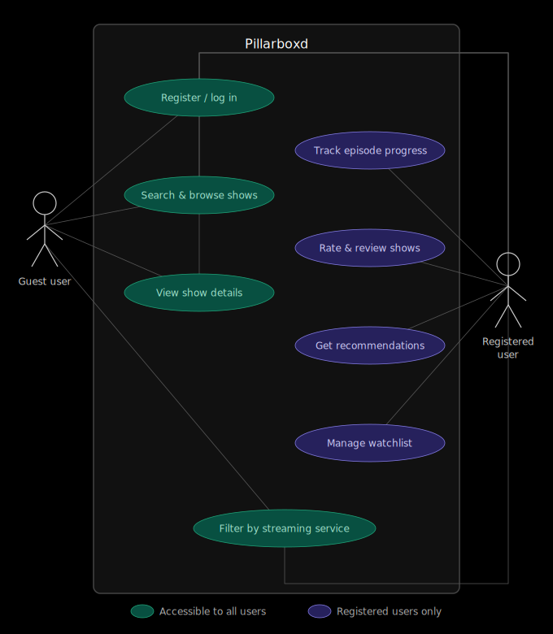
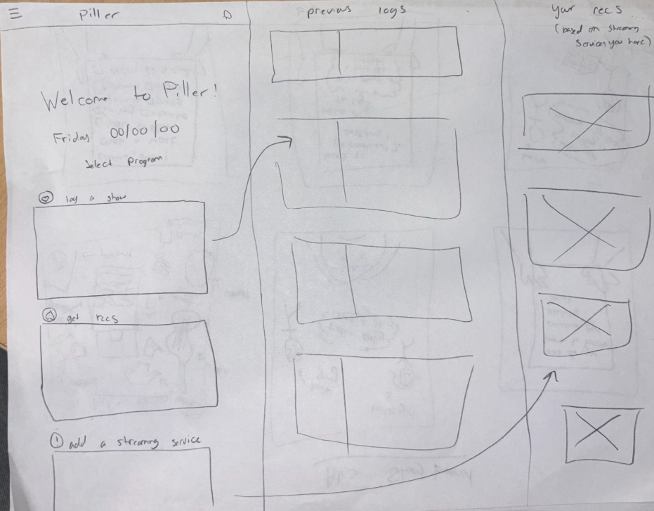

# Project Proposal

Team Number: `012-2`

App Name: `Pillarboxd`

Team Members:

| **Name**         | **Email**               | **GitHub**  |
|------------------|-------------------------|------------ |
| Ahmed Alrubeh    | <ahal8899@colorado.edu> | artfork     |
| Alexandra Ivanova| <aliv6583@colorado.edu> | Inline-Nova |
| Melody Kuoch     | <meku5835@colorado.edu> | mkuoch      |
| Cameron Malinis  | <cama3062@colorado.edu> | CamCM4      |
| Max Malkin       | <mama5162@colorado.edu> | maxmalkin   |
| Kordell Schneider| <kosc1973@colorado.edu> | Kordell-Sch |

---

## Application Description

Our application is a cross-platform TV show tracking and discovery tool designed to help users organize, analyze and discover television content across multiple streaming services. While existing platforms like Letterboxd focus primarily on movies and most streaming platforms only track viewing activity within their own ecosystems, our application bridges these gaps by allowing users to track their progress on TV shows regardless of where they are streaming them. 

A large functionality of our application centers around recommendations. We focus on two primary buckets to provide these recommendations: user activity and rating systems filtered by the streaming services the user is subscribed to. Users will be able to mark episodes as watched, keep track of where they left off in a series, and view their watching history in one centralized location, eliminating the need to manually remember progress across multiple platforms. The platform will provide personalized recommendations based on viewing history, episode ratings, and the streaming services a user subscribes to. By incorporating a user’s past reviews and their available streaming platforms, the system can suggest shows that are both relevant to their tastes and accessible to them immediately. This makes the application not only a tracking tool but also a discovery engine that helps users find new shows to watch without needing to search through multiple streaming services individually.

---

## Audience

The target audience would be streaming users that have multiple subscriptions to different websites. It can be hard for most people to find the right recommendations for shows as most of what they watch is tracked across multiple platforms. Pillarboxd aims to consolidate users into one platform to track what they watch with specific recommendations based on what they watched and reviewed before. Any newly discovered shows would have information on which streaming platform it is featured on. Pillarboxd would also have options to filter new content based on the users chosen streaming services.

---

## Vision Statement

*For the consumers of the planet, who strive for streamlined entertainment.*

---

## Development Methodology

[GitHub Project Board](https://github.com/users/maxmalkin/projects/3)

---

## Communication Plan

- We will primarily use Slack to communicate within our team.
- Our secondary source of communication will be through text messaging.

---

## Meeting Plan

- Meet with TA every Monday at 1:30pm (Online)
- Team meeting every Sunday at 5:00pm (In-person in ITLL)

---

## Case Diagram

---

## Wireframe

---

## Potential Risks and Mitigations

- API can change.
  - We can have backup options and research into api documentation.
- Overuse of gen AI tools without proper documentation.
  - Keep accountability between members.
- As more users are registered, there might be issues with storage
  - Use Supabase instead of shoving the DB into Docker image.
- Scheduling issues with how big of a group we are
  - If we have an idea or issues that we need to discuss in person, we can meet in a smaller group or just one person and then for the weekly meeting bring it up
- Data risk or breaches
  - We will have sufficient user security
